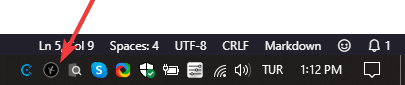
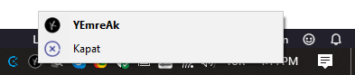

# 💞 YHotkeys

## 🔰 Ne İşe Yarar

- 👮‍♂️ Windows'un kısıltı kısayollarına alternatif olarak yaplmıştır
- ✨ Windows 10 üzerinde kişisel kısayollarınızı oluşturmanıza olanak tanır
- 👁‍🗨 Pencereleri **görev çubuğunda** veya **tray icon** olarak gösterip / gizlemenizi sağlar

## 👁‍🗨 Uygulamaya Bakış

## 👣 Kullanım Adımları

- 💫 **Exe** dosyanızın kısayolunu oluşturun (kopyasını değil)
- 🚙 Oluşturulan kısayolu istediğiniz yere taşıyabilirsiniz

> 📢 `res` dosyasına bağlı olduğundan, dizini kaybetmesi durumunda varsayılan ikonlar gözükmez

## 🚩 Scriptleri System ile Başlatma

- 🖤 Scriptinizin **kısayolunu** oluşturun (kopyasını değil)
- 🎌 <kbd>❖ Win</kbd> <kbd>R</kbd> tuşlarına basıp `shell:startup` yazıp <kbd>↩ Enter</kbd> 'a
 basın
- 🚙 Oluşturduğunzu kısayolu açılan dizine kopyalayın

## 💞 Kısayollar

### Tray Icon Kısayolları

| 🎹 Buton                      | 📑 Açıklama      |
| ----------------------------- | ---------------- |
| <kbd>❖ Win</kbd> <kbd>E</kbd> | File Explorer    |
| <kbd>❖ Win</kbd> <kbd>W</kbd> | Whatsapp Desktop |
| <kbd>❖ Win</kbd> <kbd>G</kbd> | GitHub Desktop   |
| <kbd>❖ Win</kbd> <kbd>C</kbd> | Google Calendar  |

### 👀 Küçült / Göster Kısayolları

| 🎹 Buton                      | 📑 Açıklama    |
| ----------------------------- | -------------- |
| <kbd>❖ Win</kbd> <kbd>Q</kbd> | One Note       |
| <kbd>❖ Win</kbd> <kbd>T</kbd> | Tureng         |
| <kbd>❖ Win</kbd> <kbd>G</kbd> | GitHub Desktop |

### 📂 Dizin Kısayolları

| 🎹 Buton                           | 📑 Açıklama |
| ---------------------------------- | ----------- |
| <kbd>PgDn</kbd> <kbd>g</kbd>       | GitHub      |
| <kbd>PgDn</kbd> <kbd>s</kbd>       | Shrarex     |
| <kbd>PgDn</kbd> <kbd>⇧ Shift</kbd> | Startup     |
| <kbd>PgDn</kbd> <kbd>i</kbd>       | Icons       |
| <kbd>PgDn</kbd> <kbd>d</kbd>       | Downloads   |
| <kbd>PgDn</kbd> <kbd>u</kbd>       | Yedhrab     |

### 👨‍🔧 Buton Düzeltmeleri

| 🎹 Buton                          | 📑 Açıklama |
| --------------------------------- | ----------- |
| <kbd>✲ Ctrl</kbd> <kbd>PgDn</kbd> | Page Down   |
| <kbd>✲ Ctrl</kbd> <kbd>PgUp</kbd> | Page Up     |

## 👨‍💻 Geliştirici Notları

- 👨‍🔧 Kod içerisinde en altta bulunan kısayolları değiştirebilirsin

### 🍍 Kısayol Tanımlamaları

| Sembol | Açıklama                         |
| ------ | -------------------------------- |
| `#`    | Win (Windows logo key)           |
| `!`    | Alt                              |
| `^`    | Control                          |
| `+`    | Shift                            |
| `&`    | Birden faza kısayolu birleştirme |

### 🔗 Faydalı Bağlantılar

- [👜 Mağaza Uygulamlarını Komutla Açma](https://windows.yemreak.com/gelistirici-notlarim/magaza-uygulamlarini-komutla-acma)
