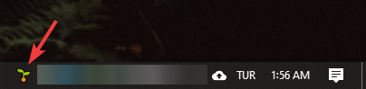
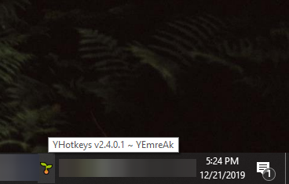
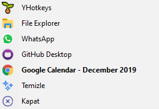

# 🌱 YHotkeys

⭐ Tek bir fide bile, windowsunu tazelemeye yeter.

## 🔰 Ne İşe Yarar

- 👮‍♂️ Windows'un kısıtlı kısayollarına alternatif olarak yapılmıştır
- ✨ Windows 10 üzerinde kişisel kısayollarınızı oluşturmanıza olanak tanır
- 👁‍🗨 Pencereleri **görev çubuğunda** veya **tray icon** olarak gösterip / gizlemenizi sağlar
- 📌 Çok sık baktığınız pencereleri sabitleyebilirsiniz (<kbd>❖ Win</kbd> <kbd>Space</kbd>)
- 🔳 <kbd>F1</kbd> butonu ile tam ekran olmayı desteklemese de pencereyi tam ekran yapabilirsin
- [🚀 YEmoji](YEmoji.md) emojilerini kısayollarla kullanamana olanak sağlar

## 👣 Kullanım Adımları

- ⏬ Uygulamanın son sürümünü [🔗 buradan](https://github.com/yedhrab/YHotkeys/raw/master/src/YHotkeys.exe) indirin
- 😁 Sadece **Exe** uzantılı dosyayı çalıştırman yeterli
- 🖱️ İmlecini 🌱 ikonunun üzerinde bekleterek, kullandığın sürümü görebilirsin
- ✨ Uygulama kendini otomatik olarak güncellemektedir
- 👀 Diğer sürümlere göz atmak için [🏷️ Release](https://github.com/yedhrab/YHotkeys/releases) alanına bakabilirsin
- [🚀 YEmoji](YEmoji.md) alanı altından emojilerin kısayollarına bakabilirsin

## 🚩 Uygulamayı System ile Başlatma

- ✨ Scriptinizin kısayolunu veya kopyasını oluşturun
- 🎌 <kbd>❖ Win</kbd> <kbd>R</kbd> tuşlarına basıp `shell:startup` yazıp <kbd>↩ Enter</kbd> 'a
 basın
- 🚙 Oluşturduğunuz kısayolu veya kopyayı açılan dizine kopyalayın

## 👁‍🗨 Uygulamaya Bakış

## 💞 Kısayollar

### 📈 Verimlilik

| ⌨️ Buton                                         | 📑 Açıklama                                              |
| ------------------------------------------------ | -------------------------------------------------------- |
| <kbd>⎇ Alt</kbd> <kbd>"</kbd> | 💫 Aynı tür pencelerer arasında gezinme
| <kbd>❖ Win</kbd> <kbd>Space</kbd>                | 📌 Aktif olan pencereyi sabitleme / sabitlemeyi kaldırma |
| <kbd>❖ Win</kbd> <kbd>⇧ Shift</kbd> <kbd>G</kbd> | 🔍 Seçili metni Google'da arama                          |
| <kbd>❖ Win</kbd> <kbd>⇧ Shift</kbd> <kbd>T</kbd> | 💱 Seçili metni Google Çeviri'de açma                    |
| <kbd>❖ Win</kbd> <kbd>⇧ Shift</kbd> <kbd>N</kbd> | 📝 Seçili alanı `notepad` 'a aktarıp, notepad'i sabitler |

### 🔔 Tray Icon Kısayolları

| ⌨️ Buton                      | 📑 Açıklama         |
| ----------------------------- | ------------------- |
| <kbd>❖ Win</kbd> <kbd>E</kbd> | 📁 File Explorer    |
| <kbd>❖ Win</kbd> <kbd>W</kbd> | 📞 Whatsapp Desktop |
| <kbd>❖ Win</kbd> <kbd>G</kbd> | 🐙 GitHub Desktop   |
| <kbd>❖ Win</kbd> <kbd>C</kbd> | 📅 Google Calendar  |

### 👀 Küçült / Göster Kısayolları

| ⌨️ Buton                      | 📑 Açıklama |
| ----------------------------- | ----------- |
| <kbd>❖ Win</kbd> <kbd>Q</kbd> | 📝 One Note |

### 📂 Dizin Kısayolları

| ⌨️ Buton                           | 📑 Açıklama      |
| ---------------------------------- | ---------------- |
| <kbd>PgDn</kbd> <kbd>⇧ Shift</kbd> | Startup          |
| <kbd>PgDn</kbd> <kbd>d</kbd>       | Downloads        |
| <kbd>PgDn</kbd> <kbd>u</kbd>       | Kullanıcı Dizini |

### 🌚 Kişisel Dizin Kısayollarım

| ⌨️ Buton                     | 📑 Açıklama |
| ---------------------------- | ----------- |
| <kbd>PgDn</kbd> <kbd>g</kbd> | GitHub      |
| <kbd>PgDn</kbd> <kbd>s</kbd> | Sharex      |
| <kbd>PgDn</kbd> <kbd>i</kbd> | Icons       |

### 👨‍🔧 Buton Düzeltmeleri

| ⌨️ Buton                          | 📑 Açıklama |
| --------------------------------- | ----------- |
| <kbd>✲ Ctrl</kbd> <kbd>PgDn</kbd> | Page Down   |
| <kbd>✲ Ctrl</kbd> <kbd>PgUp</kbd> | Page Up     |

## 💖 Destek ve İletişim

​[​​](https://github.com/yedhrab) [​​](https://www.linkedin.com/in/yemreak/) [​​](https://yemreak.com/) [​​](mailto::yedhrab@gmail.com?subject=YHotkeys%20%7C%20Github)​

​[​](https://www.patreon.com/yemreak/)

## 🔏 Lisans

**The** [**Apache 2.0 License**](https://choosealicense.com/licenses/apache-2.0/) **©️ Yunus Emre Ak**

