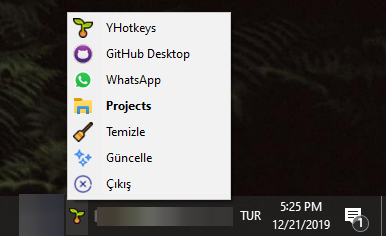

# 🌱 YHotkeys

## 🔰 Ne İşe Yarar

⭐ Tek bir fide bile, Windows'unu tazelemeye yeter.

* 👮‍♂️ Windows'un kısıtlı kısayollarına alternatif olarak yapılmıştır
* ✨ Windows üzerinde yeni [💞 Kısayollar](kisayollar/) kullanmanızı sağlar
* 🥰 Emoji kısayolları olan [🚀 YEmoji](yemoji.md) ile her yerde çalışan emoji kısayolları sunar

## 👣 Kullanım Adımları

* ⏬ Uygulamanın son sürümünü [🔗 buradan](https://github.com/yedhrab/YHotkeys/releases/latest) indirin
* 👨‍🔬 Deneysel sürümünü  [🧪 buradan](https://github.com/yedhrab/YHotkeys/raw/master/build/YHotkeys-Installer.exe) indirebilirsin
* 👀 Uygulamanın sunduğu kısayollar için [💞 Kısayollar](./#kisayollar) alanına bakabilirsin
* 🥰  YEmoji kısayolları için [🚀 YEmoji](yemoji.md) alanına bakmalısın
* 🌱 İkonuna tıklayarak bu sayfaya yönelebilirsin


👀 Diğer sürümlere göz atmak için [🏷️ Release](https://github.com/yedhrab/YHotkeys/releases) alanına bakmalısın


## ✨ Güncelleme İşlemleri

* 🖱️ İmlecini 🌱 ikonunun üzerinde bekleterek, kullandığın sürümü görebilirsin
* ✨ Uygulama kendini otomatik olarak güncellemektedir
* 📋 Güncellemeler hakkında detaylara [✨ Changelog](changelog.md) alanında erişebilirsin


📢 Güncellemede sorun yaşarsan [👣 Kullanım Adımları](./#kullanim-adimlari) alanından son sürümü indirebilirsin


## 🚩 System ile Başlatma

* ✨ Scriptinizin kısayolunu veya kopyasını oluşturun
* 🎌 ❖ Win R tuşlarına basıp `shell:startup` yazıp ↩ Enter 'a basın
* 🚙 Oluşturduğunuz kısayolu veya kopyayı açılan dizine kopyalayın

## 👁‍🗨 Uygulamaya Bakış

## 💖 Destek ve İletişim

​[​​](https://github.com/yedhrab) [​​](https://www.linkedin.com/in/yemreak/) [​​](https://yemreak.com/) [​​](mailto:yemreak.com@gmail.com?subject=YHotkeys%20%7C%20GitHub)​

​[​](https://www.patreon.com/yemreak/)

## 🔏 Lisans

**The** [**Apache 2.0 License**](https://choosealicense.com/licenses/apache-2.0/) **©️ Yunus Emre Ak**

