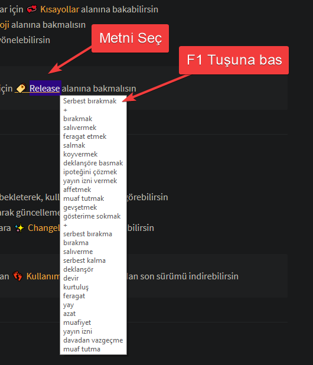
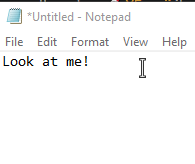
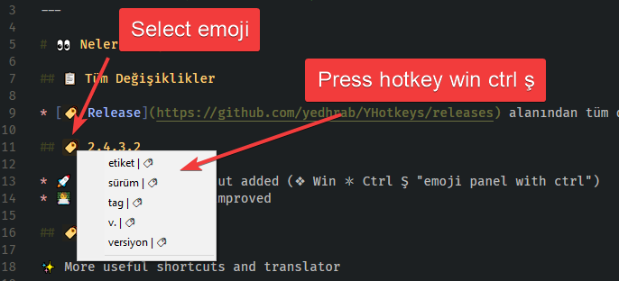

# 📋 Seçili Metin Yönetimi

## 🔤 Seçili Metin İşlemleri

| ⌨️ Buton | 📑 Açıklama |
| :--- | :--- |
| F1 | 💱 Seçili metni çevirme ve popupda gösterme |
| ⇧ Shift F1 | 💱 Seçili meti çevirip değiştirme |
| ❖ Win ✲ Ctrl Ş | 🧐 Seçili olan emoji için hangi kısayol atandığını gösterir |

### 💬 Popup ile çeviri

### 💱 Metni çevirip, değiştirme

### 🔳 Emoji arama paneli

## ✴️ Seçili Metin için Pencereler

| ⌨️ Buton | 📑 Açıklama |
| :--- | :--- |
| ❖ Win ✲ Ctrl E | 👨‍💼 Seçili metni varsayılan uygulama ile çalıştırır |
| ❖ Win ✲ Ctrl C | 🖤 Seçili metni Komut İstemi üzerinde açar |
| ❖ Win ✲ Ctrl G | 🔍 Seçili metni Google'da arama |
| ❖ Win ✲ Ctrl T | 💱 Seçili metni Google Çeviri'de açma |
| ❖ Win ✲ Ctrl N | 📝 Seçili alanı `notepad` 'a aktarıp, notepad'i sabitler |

> 💁‍♂️ HTTP urllerinin çalıştırılması tarayıcı ile olur.

## 🔨 Seçili Metni Düzeltme

| ⌨️ Buton | 📑 Açıklama |
| :--- | :--- |
| ❖ Win ✲ Ctrl ⇧ Shift U | ⬆ Seçili metni büyük harf \(Uppercase\) yapar |
| ❖ Win ✲ Ctrl ⇧ Shift L | ⬇️ Seçili metni küçük harf \(Lowercase\) yapar |
| ❖ Win ✲ Ctrl ⇧ Shift I | ↔️ Seçili metni ters boyutlu harf \(Inverted\) yapar |
| ❖ Win ✲ Ctrl ⇧ Shift E | ↖️ Seçili metni encode eder |
| ❖ Win ✲ Ctrl ⇧ Shift D | ↘️ Seçili metni decode eder |
| ❖ Win ✲ Ctrl ⇧ Shift T | 💱 Seçili meti çevirip değiştirme |

